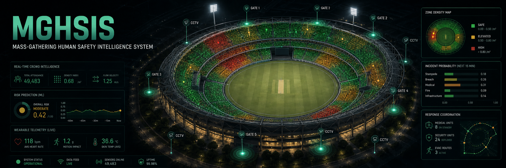
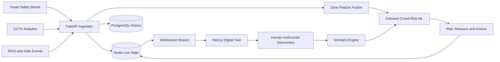

# MGHSIS

**Mass-Gathering Human Safety Intelligence System**

> A local-first safety intelligence platform that combines wearable telemetry, CCTV crowd analytics, gate events, machine-learning risk prediction, and a venue Digital Twin to support earlier, evidence-backed intervention at high-density public events.


## Overview

MGHSIS is an SIH2026 software prototype for cricket stadiums, concerts, pilgrimages, festivals, and other mass gatherings. It brings fragmented safety signals into one operational workflow:

```text
Sense -> Fuse -> Predict -> Visualise -> Intervene -> Verify
```

The platform answers five questions:

1. Is an individual potentially in distress?
2. Is dangerous crowd accumulation developing?
3. Does the authenticated population match physical observations?
4. Which intervention should an operator consider?
5. Did that intervention reduce the projected risk?

MGHSIS is decision-support software. It does not perform medical diagnosis, facial recognition, autonomous policing, or automatic control of physical gates.

## What Is Implemented

- A polished Next.js operations portal and command centre featuring a unified two-level operations shell, a graphite interface system, and a keyboard-accessible command palette with live module search.
- A cricket-stadium Digital Twin with blocks, segments, premium areas, gates, CCTV markers, band stations, and extended heatmap coverage (south service bays, concourse sections, President Gallery, and suite floors).
- A deterministic 50,000-band event registry with searchable individual telemetry records.
- 10,000 interactive on-map points allowing exact band selection across the stadium, President Gallery, and hospitality suite floors.
- Human Risk, Crowd Risk, and Population Integrity Risk workflows.
- Real-time three-engine zone fusion, 5-minute forecasts, and population reconciliation.
- A persisted crowd-risk ML model with explainable probability output, recommended actions, and vectorized batch inference.
- Live scenario virtualisation with stable scenario controls across congestion, distress, breach, gateway-failure, and crowd-redirect projections.
- Before-and-after intervention verification using preserved simulator metrics to measure response effectiveness.
- FastAPI hardware ingestion with timestamp and sequence validation, backed by PostgreSQL history and Redis pub/sub streams.
- Executable band, gate, CCTV, and scenario simulator services.
- Alert lifecycle, intervention authorization, replay, analytics, and system-health views.

## System Architecture



| Layer | Technology | Responsibility |
| --- | --- | --- |
| Operations UI | Next.js 16, React, TypeScript | Command centre, Digital Twin, bands, alerts, interventions, analytics |
| Core API | FastAPI, Pydantic | Validation, inference, simulation, health, hardware ingestion |
| Live runtime | Redis | Shared state, replay protection, cache, pub/sub, WebSockets |
| Durable history | PostgreSQL | Hardware observations and event audit history |
| Intelligence | scikit-learn, NumPy | Zone-level crowd-risk classification and probability scoring |
| Simulation | Python services | Band, CCTV, gate, and scenario telemetry generation |

## Intelligence Model

### Three Risk Engines

| Engine | Purpose | Example signals |
| --- | --- | --- |
| Human Risk | Identify potential individual distress | HR, SpO2, motion, fall, immobility, SOS, signal reliability |
| Crowd Risk | Detect dangerous zone conditions | Density, utilisation, flow, accumulation, speed, dwell, route geometry |
| Population Integrity | Detect count inconsistencies | Gate records, active bands, CCTV observations, gateway health |

### Crowd-Risk ML Flow

The onboard `HistGradientBoostingClassifier` receives a versioned 22-feature zone vector. It returns:

- `LOW`, `MODERATE`, `HIGH`, or `CRITICAL` risk;
- a 0-100 advisory score;
- confidence and per-class probabilities;
- rising, stable, or falling trend;
- ranked contributing reasons;
- recommended operator actions.

The reproducible synthetic dataset contains 100,000 zone observations:

| Evaluation fact | Value |
| --- | ---: |
| Training split | 80,000 rows (80%) |
| Holdout split | 20,000 rows (20%) |
| Accuracy | 90.79% |
| Macro F1 | 89.05% |
| Weighted F1 | 90.95% |
| Critical precision | 94.44% |
| Critical recall | 87.28% |
| Critical F1 | 90.72% |
| Multiclass log loss | 0.2745 |

These results measure recovery of the synthetic generator, not real-world safety performance. Production use requires field data, sensor calibration, temporal validation, drift monitoring, independent safety review, and a human-in-the-loop operating procedure.

Read [docs/ML.md](docs/ML.md) for the model contract and limitations.

## Digital Twin

The dedicated `/digital-twin` workspace provides:

- Live and Virtualisation modes with stable scenario controls across congestion and distress projections.
- Dense Canvas rendering with 10,000 interactive map points and larger touch/pen hit targets.
- Direct band selection on the map (including President Gallery and suite floors) with ID, zone, and risk details.
- Comprehensive heatmap coverage across seating sectors, concourses, south service bays, President Gallery, and hospitality suites.
- G1 and G8 replacement/charging station beacons positioned in clear exterior margins with directional leader arrows.
- Live three-engine zone fusion, 5-minute forecasts, and population reconciliation.
- Search and filtering by band ID, zone, connectivity, status, and distress.
- Live zone distributions and highest-risk band records.
- Projected crowd movement, intervention re-scoring, and evidence-backed verification.

The event model contains 50,000 registered bands, with 49,483 represented as connected and authenticated in the current demonstration state.

## Quick Start

### Prerequisites

- Node.js and npm
- Python 3.12 or newer
- Docker Desktop
- `lsof` on macOS/Linux

### First-Time Setup

```bash
git clone https://github.com/InsaneCoder789/SIH2026-MGHSIS.git
cd SIH2026-MGHSIS

cp .env.example .env
npm install

python3 -m venv .venv
.venv/bin/pip install -r apps/api/requirements.txt

chmod +x start-all.sh
```

### Start Everything

Open Docker Desktop, then run:

```bash
./start-all.sh
```

The launcher starts PostgreSQL, Redis, FastAPI, and Next.js, performs infrastructure health checks, and shuts down cleanly with `Ctrl+C`.

| Service | URL |
| --- | --- |
| Operations portal | http://localhost:3000 |
| Digital Twin | http://localhost:3000/digital-twin |
| Command centre | http://localhost:3000/command-center |
| FastAPI documentation | http://localhost:8000/docs |
| System readiness | http://localhost:8000/api/v1/system/readiness |

### Full Docker Stack

```bash
cp .env.example .env
docker compose up --build
```

Default ports are `3000` for the web app, `8000` for the API, `5433` for host PostgreSQL, and `6379` for Redis.

## Application Routes

| Route | Purpose |
| --- | --- |
| `/` | Operations overview and module navigation |
| `/command-center` | Compact command-centre dashboard and response controls |
| `/digital-twin` | Dedicated live twin, band inspection, layers, and virtualisation |
| `/bands` | Searchable and filterable 50,000-band registry |
| `/bands/:id` | Individual telemetry, explainable risk, and event history |
| `/alerts` | Alert triage, evidence, status, and assignment |
| `/interventions` | Authorization and post-action verification |
| `/analytics` | ML runtime, model metrics, and zone predictions |
| `/scenario-lab` | Stateful event simulation controls |
| `/replay` | Timeline and historical event reconstruction |
| `/cctv` | Camera and crowd-analytics workspace |
| `/system-health` | API, Redis, PostgreSQL, ML, simulation, and ingestion health |

## Core API Endpoints

| Method and endpoint | Purpose |
| --- | --- |
| `GET /api/v1/ml/crowd-risk/status` | Model version, feature contract, split, and metrics |
| `POST /api/v1/ml/crowd-risk/predict` | Single-zone crowd-risk inference |
| `POST /api/v1/ml/crowd-risk/predict/batch` | Vectorised multi-zone inference |
| `GET /api/v1/ml/crowd-risk/demo-zones` | Predictions for the demonstration venue |
| `POST /api/v1/hardware/observations` | Ordered CCTV, BLE, RFID, manual, or simulator ingestion |
| `GET /api/v1/simulation/state` | Current virtual event and scored zones |
| `POST /api/v1/simulation/scenario` | Activate a deterministic scenario |
| `POST /api/v1/simulation/action` | Apply and evaluate an intervention |
| `GET /api/v1/system/health` | Full dependency diagnostics |
| `GET /api/v1/system/readiness` | Deployment readiness |
| `WS /api/v1/ws/events` | Live Redis-backed operational events |

## Simulator Services

With the API running, each simulator can publish real observations through the production ingestion path:

```bash
PYTHONPATH=. .venv/bin/python services/band-simulator/main.py --mode large --ticks 1
PYTHONPATH=. .venv/bin/python services/gate-simulator/main.py --ticks 1
PYTHONPATH=. .venv/bin/python services/cctv-analytics/main.py --ticks 1
PYTHONPATH=. .venv/bin/python services/scenario-engine/main.py --scenario congestion --ticks 4
```

Use `--ticks 0` for continuous band, gate, or CCTV publishing.

## Verification

```bash
npm run lint
npm run build
PYTHONPATH=apps/api:. .venv/bin/pytest apps/api/tests -q
```

Retrain the deterministic ML artifact with:

```bash
PYTHONPATH=apps/api .venv/bin/python -m app.ml.train
```

## Suggested Demo Flow

1. Open `/digital-twin` and inspect the venue layers.
2. Select bands in a regular block and in each premium tier.
3. Open a selected band's full telemetry record.
4. Show the complete registry and risk filters.
5. Run the congestion scenario in Virtualisation mode.
6. Apply a crowd redirect and observe projected movement and re-scoring.
7. Open Alerts and authorize an Intervention.
8. Finish on System Health to show the complete runtime is connected.

## Repository Structure

```text
apps/
  web/                     Next.js operations portal and Digital Twin
  api/                     FastAPI core, ML runtime, persistence, and tests
services/
  band-simulator/          Wearable fleet telemetry publisher
  gate-simulator/          Entry, exit, and integrity-event publisher
  cctv-analytics/          Replaceable crowd-observation adapter
  scenario-engine/         Deterministic scenario driver
docs/                      Architecture, ML, hardware, twin, and presentation docs
packages/                  Shared contracts and risk-model boundaries
infra/                     Local infrastructure configuration
docker-compose.yml         Web, API, PostgreSQL, and Redis stack
start-all.sh               One-command local launcher
MASTER.md                  Product and implementation source of truth
```

## Documentation

- [Architecture](docs/Architecture.md)
- [Digital Twin](docs/DigitalTwin.md)
- [Machine Learning](docs/ML.md)
- [Hardware Integration](docs/HardwareIntegration.md)
- [Presentation Brief](docs/MGHSIS-Presentation.md)
- [Project Source of Truth](MASTER.md)

## Safety, Privacy, and Scope

- ML output is advisory and requires human authorization.
- Human Risk is non-diagnostic.
- No facial recognition is used.
- The system identifies population inconsistencies, not suspected individuals.
- Synthetic telemetry is deterministic and non-identifying.
- Real hardware integration remains an adapter boundary until field deployment.
- Operational deployment requires venue-specific calibration and independent review.

## Repository Description

**GitHub short description:** Local-first mass-gathering safety intelligence with wearable telemetry, CCTV and gate fusion, onboard ML, a real-time stadium Digital Twin, and human-authorized intervention simulation.
